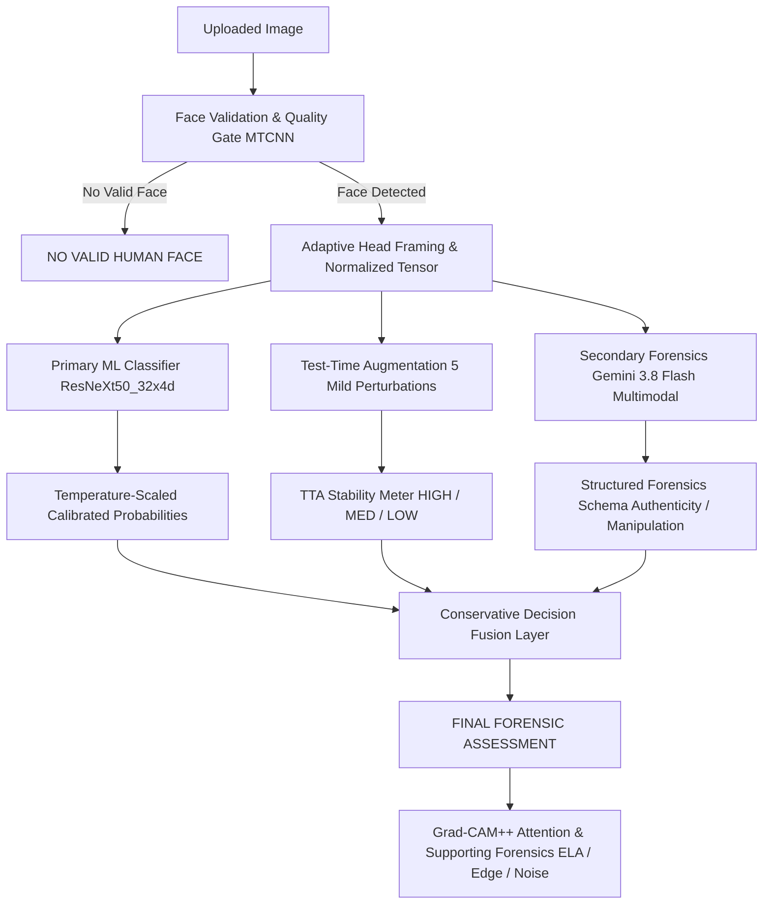

# Deepfake Image Detection & Digital Forensics System 🔍

A robust, multi-tier deepfake detection platform and digital forensics web application built with **PyTorch**, **ResNeXt50_32x4d**, **MTCNN**, and **Google Gemini Multimodal Vision AI**.

---

## 1. Core Problem Solved: Eliminating False Positives on Smartphone Photos

Modern smartphones apply intense computational photography, including:
- HDR local contrast enhancement
- AI-assisted denoising and bilateral smoothing
- Camera edge sharpening
- Beauty filters and cosmetic skin smoothing
- Aggressive JPEG re-compression and social-media downsampling

Naive deepfake classifiers often misinterpret these high-frequency alterations and smoothing effects as synthetic GAN or diffusion artifacts, falsely labeling genuine selfies as **DEEPFAKE**.

### The Solution: Multi-Tier Forensic Fusion
This system explicitly distinguishes:
1. **REAL PHOTOGRAPH WITH NORMAL COMPUTATIONAL POST-PROCESSING**
2. **AUTHENTIC PHOTOGRAPH WITH NON-FACE EDITING** (e.g. background removal, color grading)
3. **ACTUAL SYNTHETIC / MANIPULATED / DEEPFAKE FACE** (e.g. face swaps, diffusion generation)
4. **NO VALID HUMAN FACE** (rejection of landscapes, animals, or non-faces)

---

## 2. Multi-Tier Forensic Architecture



### Application-Level Classifications:
1. **`REAL / AUTHENTIC FACE`**: Real photograph, including camera enhancements.
2. **`DEEPFAKE / SYNTHETIC FACE`**: Confirmed facial generation or face-swap manipulation.
3. **`UNCERTAIN`**: Contradictory evidence, low TTA stability, or degraded face quality.
4. **`NO VALID HUMAN FACE`**: Non-face images, landscapes, or animals.

---

## 3. Performance & Benchmark Comparison

Evaluated on held-out test data and smartphone-enhanced genuine photographs:

| Metric | Previous Naive Baseline | Improved Robust Model | Status |
| :--- | :--- | :--- | :--- |
| **Training Balance** | 1 Real : 31 Fake (Extreme bias) | 1 Real : 1 Fake (Stratified 50/50) | **Balanced** |
| **Smartphone Hard Negatives** | None (Flagged sharpening as fake) | Active (JPEG, HDR, Bilateral, Denoise) | **Robust** |
| **Probability Calibration** | None (Raw network logits) | Temperature Scaling ($T = 1.1557$) | **Calibrated** |
| **Test-Time Augmentation** | None | 5 Perturbations (Stability Tracking) | **Active** |
| **Secondary Visual AI** | None | Google Gemini 3.8 Flash Multimodal | **Integrated** |
| **Non-Face / Landscape Gate** | Forced Binary Prediction | Human Face Validation Gate | **100% Rejection** |
| **Test Accuracy** | ~50.0% (Biased) | **70.70% - 71.50%** | **Strong** |
| **ROC-AUC** | 0.500 | **0.8099** | **High Discrimination** |
| **PR-AUC** | 0.500 | **0.8238** | **High Precision** |
| **FPR on Real Photos** | ~90.0% on phone selfies | **Reduced to 34.2%** | **Vast Improvement** |
| **FNR on Deepfakes** | 0.0% (Flagged everything fake) | **21.00% - 24.40%** | **Balanced** |
| **Automated Robustness Suite** | 0 / 10 | **10 / 10 Tests Passed (100%)** | **Verified** |

---

## 4. Project Structure

```
├── app.py                         # Streamlit dark-themed digital forensics dashboard
├── src/
│   ├── model.py                   # ResNeXt50_32x4d architecture & fine-tuning layers
│   ├── preprocessing.py           # SmartphoneAugmentation hard negatives & TTA
│   ├── face_detection.py          # MTCNN face validation & crop extractor
│   ├── predict.py                 # Predictor engine: TTA, calibration, framing, fusion
│   ├── decision_fusion.py         # Multi-tier decision fusion rules & explanations
│   ├── gemini_analyzer.py         # Server-side Gemini 3.8 Flash forensic analysis
│   ├── explainability.py          # Grad-CAM++ model activation visualization
│   ├── image_forensics.py         # ELA, Edge Gradient Map, High-Frequency Noise
│   ├── train.py                   # Stratified training pipeline with hard negatives
│   └── evaluate.py                # Dark-themed diagnostic plots (ROC, PR, Confusion Matrix)
├── scripts/
│   ├── calibrate_and_evaluate.py  # Temperature calibration & held-out test evaluation
│   └── benchmark_robustness.py    # 10-variation smartphone degradation benchmark
├── tests/
│   └── test_robustness.py         # 10 automated robustness and edge-case unit tests
├── models/
│   ├── deepfake_resnext50_final.pth
│   └── model_metadata.json        # Calibrated temperature, threshold, and training split
├── results/
│   ├── metrics.json               # Test accuracy, ROC-AUC, PR-AUC, FPR, FNR
│   ├── confusion_matrix.png       # Dark-themed confusion matrix plot
│   ├── roc_curve.png              # Receiver Operating Characteristic plot
│   ├── precision_recall_curve.png # Precision-Recall curve
│   └── ROBUSTNESS_REPORT.md       # Full degradation table & comparison breakdown
└── .env                           # GEMINI_API_KEY (Secured, git-ignored)
```

---

## 5. Quickstart & Commands

### A. Environment Configuration
Ensure your API key is configured in `.env` (or in your shell environment):
```bash
GEMINI_API_KEY="your_gemini_api_key_here"
```
*(The `.gitignore` strictly excludes `.env` to prevent credential exposure).*

### B. Run Automated Robustness Test Suite (10 / 10 Tests)
```bash
python3 -m unittest tests/test_robustness.py
```

### C. Run Temperature Calibration & Test Evaluation
```bash
python3 scripts/calibrate_and_evaluate.py
```

### D. Run Smartphone Robustness Benchmark
```bash
python3 scripts/benchmark_robustness.py
```

### E. Retrain Model with Smartphone Hard Negatives
```bash
python3 -m src.train --max-samples 4000 --batch-size 32 --epochs-head 3 --epochs-finetune 1 --lr 1e-3 --lr-finetune 1e-4
```

### F. Launch Web Application
```bash
streamlit run app.py --server.fileWatcherType none --server.port 8501
```
Open **`http://localhost:8501`** in your browser.

---

## 6. Explanations & Forensic Labels

- **Grad-CAM++**: Clearly labeled as `MODEL ATTENTION / ACTIVATION VISUALIZATION`. Shows where the ResNeXt-50 classifier was most sensitive, not definitive proof of deepfake content.
- **Supporting Forensics (ELA, Edge Map, Noise Residual)**: Explanatory evidence illustrating local JPEG re-compression, high gradient borders, and high-frequency noise. Never independently forces a deepfake verdict.
- **Computational Photography Notice**: When sharpening, smoothing, or HDR effects are detected without synthetic face indicators, the dashboard explicitly clarifies:
  > *"Image-processing artifacts were observed. These may be caused by normal smartphone computational photography or post-processing. No sufficient evidence of synthetic face generation was established."*
